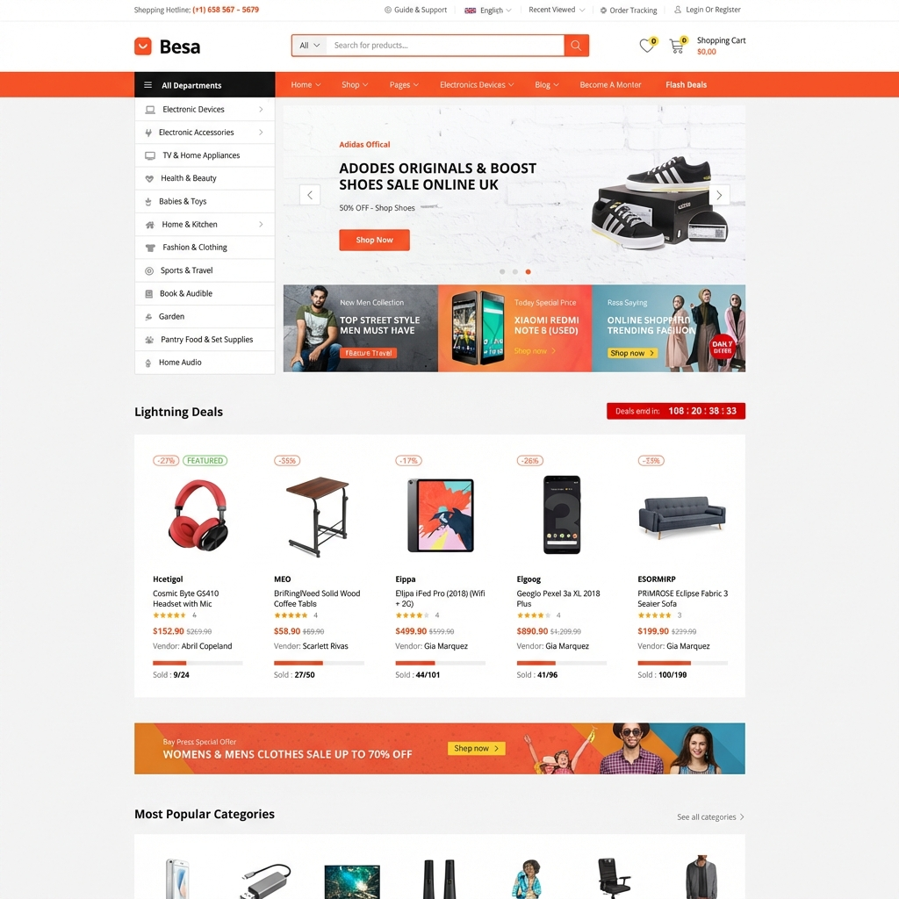

# Besa - Modern E-commerce Platform with Vue 3



## Overview

**Besa** is a modern, responsive e-commerce application built with the **Vue.js 3** ecosystem. This project serves as a comprehensive masterclass in building scalable frontend architectures, demonstrating best practices in component design, state management, and routing.

Designed as a reference implementation, it showcases how to replicate complex, real-world interfaces with clean, maintainable code.

## Technology Stack

- **Framework**: [Vue.js 3](https://vuejs.org/) (Composition API)
- **Build Tool**: [Vite](https://vitejs.dev/)
- **State Management**: [Pinia](https://pinia.vuejs.org/)
- **Routing**: [Vue Router 4](https://router.vuejs.org/)
- **Styling**: Modern CSS3 (Scoped, Flexbox/Grid) - _No framework dependencies_

## Key Features

- **Modular Architecture**: Component-driven development with clear separation of concerns.
- **Dynamic Layouts**: flexible layout system using Vue Router and Slots.
- **Global State Management**: efficient shopping cart and user data handling with Pinia.
- **Responsive Design**: Fluid grid layouts adapting to all device sizes.
- **Custom UI Components**: Built-from-scratch UI elements (Carousels, Product Cards) without heavy UI libraries.

## Getting Started

### Prerequisites

- Node.js (LTS version recommended)
- npm or yarn

### Installation

1.  Clone the repository:

    ```bash
    git clone https://github.com/yourusername/besa-ecommerce.git
    cd besa-ecommerce
    ```

2.  Install dependencies:

    ```bash
    npm install
    ```

3.  Start the development server:
    ```bash
    npm run dev
    ```

## Project Structure

```
src/
├── assets/          # Static assets and global styles
├── components/      # Reusable UI components (Buttons, Cards, Inputs)
├── layouts/         # App-wide layouts (Default, Empty, Dashboard)
├── router/          # Route definitions and navigation guards
├── stores/          # Pinia state stores (Cart, User, Products)
├── views/           # Page controllers (Home, Shop, ProductDetails)
├── App.vue          # Root component
└── main.js          # Application entry point
```

## Workshops & Learning Outcomes

This project is built progressively to cover:

1.  **Project Initialization**: Vite configuration and folder structure.
2.  **Layout System**: Creating persistent headers/footers.
3.  **Component Patterns**: Props, emits, and slots for reusability.
4.  **Routing Logic**: Dynamic params (`/product/:id`) and nested routes.
5.  **State Management**: Complex state logic with Pinia actions and getters.

---

_Designed and implemented by Jojo._
